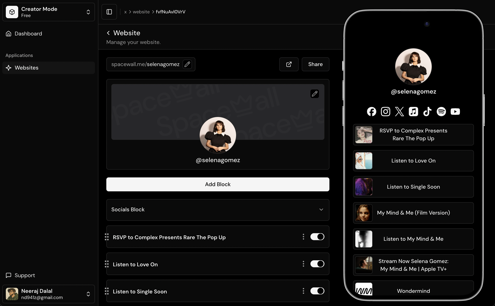

# 🚀 Spacewall – A Modern Link-in-Bio Builder

Spacewall is an open-source, Linktree-like website builder that lets creators and businesses craft their own link-in-bio pages. It’s built for speed, flexibility, and a smooth user experience – including **drag-and-drop blocks**, **optimistic UI updates** and **edge caching via CloudFront**.

